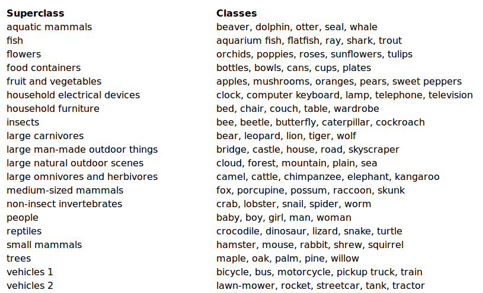

[cifar-100数据集](https://www.cs.toronto.edu/~kriz/cifar.html)解析和[cifar-10数据集解析](https://www.zhuajin.tech/posts/43d7ec86.html)类似，区别在于`cifar-100`共`20`个超类（`superclass`），`100`个子类，所以每张图像有两个标签：超类标签（`coarse label`）和子类标签（`fine label`）



## 文件解析

下载[python压缩包](https://www.cs.toronto.edu/~kriz/cifar-100-python.tar.gz)，解压后里面有`3`个文件：`meta/test/train`

```
def print_keys():
    data_list = ['meta', 'test', 'train']
    data_dir = '/home/zj/data/cifar-100-python/'

    for item in data_list:
        data_path = os.path.join(data_dir, item)
        data = unpickle(data_path)

        print(item, list(data.keys()))
```

每个文件都是一个字典结构，依次输出文件的键

```
meta [b'fine_label_names', b'coarse_label_names']
test [b'filenames', b'batch_label', b'fine_labels', b'coarse_labels', b'data']
train [b'filenames', b'batch_label', b'fine_labels', b'coarse_labels', b'data']
```

在元信息文件、训练文件和测试文件中，相比`cifar-10`数据集多个一个标签信息

## 图像解析

按以下结构保存图像数据：

```
.
├── test
    ├── coarse_labels
        └── fine_labels
└── train
    ├── coarse_labels
       └── fine_labels
```

实现代码如下：

```
def unpickle(file):
    with open(file, 'rb') as fo:
        dict = pickle.load(fo, encoding='bytes')
    return dict


def write_img(data, coarse_labels, fine_labels, filenames, isTrain=True):
    res_data_dir = '/home/zj/data/decompress_cifar_100'

    if isTrain:
        data_dir = os.path.join(res_data_dir, 'train')
    else:
        data_dir = os.path.join(res_data_dir, 'test')

    if not os.path.exists(data_dir):
        os.mkdir(data_dir)

    N = len(coarse_labels)
    for i in range(N):
        coarse_cate_dir = os.path.join(data_dir, str(coarse_labels[i]))
        if not os.path.exists(coarse_cate_dir):
            os.mkdir(coarse_cate_dir)
        fine_cate_dir = os.path.join(coarse_cate_dir, str(fine_labels[i]))
        if not os.path.exists(fine_cate_dir):
            os.mkdir(fine_cate_dir)
        img_path = os.path.join(fine_cate_dir, str(filenames[i], encoding='utf-8'))

        img = data[i].reshape(3, 32, 32)
        img = np.transpose(img, (1, 2, 0))
        img = cv2.cvtColor(img, cv2.COLOR_RGB2BGR)
        cv2.imwrite(img_path, img)


def decompress_img():
    data_list = ['test', 'train']
    data_dir = '/home/zj/data/cifar-100-python/'

    for item in data_list:
        data_dir = os.path.join(data_dir, item)
        di = unpickle(data_dir)

        batch_label = str(di.get(b'batch_label'), encoding='utf-8')
        filenames = di.get(b'filenames')
        fine_labels = di.get(b'fine_labels')
        coarse_labels = di.get(b'coarse_labels')
        data = di.get(b'data')

        if 'train' in batch_label:
            write_img(data, coarse_labels, fine_labels, filenames)
        else:
            write_img(data, coarse_labels, fine_labels, filenames, isTrain=False)
```

## 图像展示

随机读取`100`张图像显示如下：

```
if __name__ == '__main__':
    data_dir = '/home/zj/da
文件解析

far-100-python/train'

    di = unpickle(data_dir)
文件解析


    batch_label = str(di.get(b'batch_label'), encoding='utf-8')
    filenames = di.get(b'filenames')
    fine_labels = di.get(b'fine_labels')
    coarse_labels = di.get(b'coarse_labels')
    data = di.get(b'data')

    N = 10
    W = 32
    H = 32
    ex = np.zeros((H * N, W * N, 3))
    for i in range(N):
        for j in range(N):
            img = data[i * N + j].reshape(3, H, W)
            img = np.transpose(img, (1, 2, 0))
            img = cv2.cvtColor(img, cv2.COLOR_RGB2BGR)

            ex[i * H:(i + 1) * H, j * W:(j + 1) * W] = img
    cv2.imwrite('cifar-100.png', ex)
```

