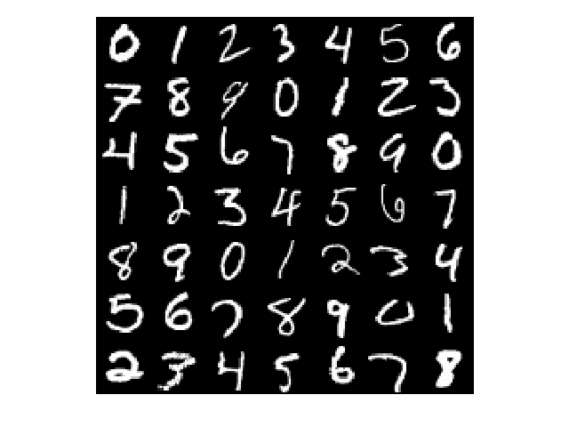
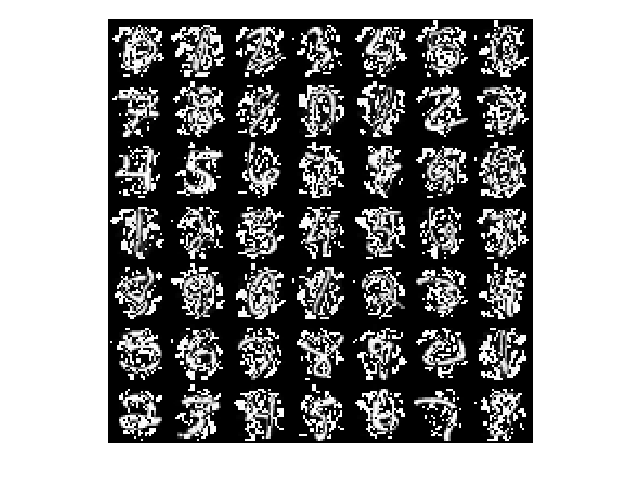
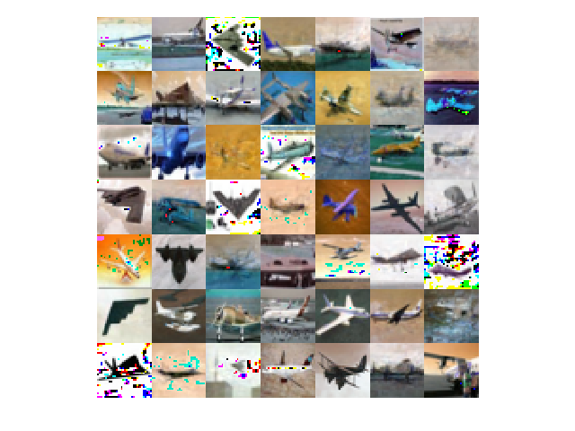

主成分分析（`princial component analysis`，简称`PCA`）是一种无监督的数据降维操作，它通过最大化方差方法来寻找低维空间，能够有效减轻计算量的同时保证处理数据有效性

主要参考文章[PCA数学原理](https://blog.csdn.net/u012005313/article/details/50877366)，里面做了生动的数学原理分析

相关线性代数、几何学以及统计学数学内容参考：

[]()

[]()

本文主要内容如下：

1. 原理解析
2. 如何重建原始数据
3. 如何确定$k$值
4. 操作步骤
5. `numpy`实现

## 原理解析

* 为什么要进行数据降维？

1. 减少内存或磁盘存储
2. 加快算法运行
3. 数据可视化（*将多维数据将为2维或3维，实现数据可视化*）

* 为什么能够进行数据降维?

原始数据之间存在结构相关性，某些数据的丢失不影响后续对数据的处理

* 数据降维过程应该注意哪些？

1. 保留尽可能多的原始数据内部的结构信息
2. 处理后的数据不存在相关性

* 如何保证能够得到尽可能多的原始数据内部的结构信息？

原始数据内部的结构信息不会在投影后重叠在一起，低维空间数据尽可能分散，也即使说投影后每个字段数据的**方差**越大越好

假设有`M`个`N`维**列向量**数据$X\in R^{N\times M}$，第$i$个字段数据的方差计算如下：

$$
Var(X_{,j}) = \frac {1}{M} \sum_{j=1}^{M} (X_{ij} - \mu_{i})^{2}
$$

$\mu_{i}$表示第$i$个字段数据的均值

$$
\mu_{i} = \frac {1}{M} \sum_{j=1}^{M}X_{ij}
$$

* 如何保证处理后的数据不存在相关性

投影后不同字段之间的**协方差**为`0`，表示不存在相关性，数据完全独立

第$i$个和第$l$个字段数据之间的协方差计算如下：

$$
Cov(X_{i}, X_{l}) = \frac {1}{M} \sum_{j=1}^{M} X_{i,j}X_{l,j}
$$

* 如何计算方差和协方差?

原始数据$X$有$N$维，表示有$N$个字段，计算字段之间的协方差矩阵$C\in R^{N\times N}$，对角元素表示方差，非对角元素表示协方差

$$
C = \begin{bmatrix}
c_{11} & c_{12} & \cdots & c_{1N}\\ 
c_{21} & c_{22} & \cdots & c_{2N}\\ 
\vdots & \vdots & \vdots & \vdots\\ 
c_{N1} & c_{N2} & \cdots & c_{NN}
\end{bmatrix}
=\frac {1}{M}XX^{T}
$$

其中$c_{ii}$表示第$i$个字段的随机变量，$c_{ij}$表示第$i$个和第$j$个字段的随机变量

**目标是协方差值为`0`,也就是协方差矩阵对角化**

* 如何计算协方差矩阵对角化？

协方差矩阵$C$是实对称矩阵，所以存在正交矩阵$Q$，能得到

$$
Q^{-1}CQ = Q^{T}CQ = \Lambda = diag(\lambda_{1}, \lambda_{2}, ..., \lambda_{n})
$$

其中$\lambda_{1}, \lambda_{2}, ..., \lambda_{n}$为$C$的特征值

正交矩阵$Q$由特征值对应的特征向量正交化且单位化后组成，**$Q$的第$j$列特征向量对应特征值$\lambda_{j}$**

**所以计算协方差矩阵的特征值和特征向量，将特征值（*方差*）从大到小排列，取前$k$个对应的特征向量（*列向量*），就是低维空间的基**

* 如何执行降维操作？

前$k$个特征向量（*转置成行向量*）组成的矩阵$P\in R^{k\times N}$，所以

$$
Y = PX \in R^{k\times M}
$$

$Y$表示数据$X$投影到矩阵$P$为基的低维空间数据

## 需不需要数据去量纲？

参考：

[PCA填坑篇——使用PCA到底需不需要数据去量纲？](https://www.jianshu.com/p/c21c0e2c403a)

[PCA要对数据进行预处理的原因](https://www.jianshu.com/p/ae9db78ebb0f)

需要对原始数据去量纲，也就是让属性成为单纯一个数，去除属性单位带来的影响（比如`cm`和`kg`）

需要统一单位，所以需要对原始数据进行标准化操作，原始数据减去均值后，再除以各字段的标准差

**注意：在图像操作中，每个字段取值均为`[0-255]`，可以不进行去量纲操作，减去均值即可**

## 如何重建原始数据

对投影数据进行逆操作

$$
X_{approx} = P^{T}\cdot Y  = R^{N\times k}\cdot R^{k\times M} = R^{N\times M}
$$

需要每个字段加上均值

$$
(X_{approx})_{i} = (X_{approx})_{i} + \mu_{i}
$$

还需要对每个字段乘以字段标准差

$$
(X_{approx})_{i} = (X_{approx})_{i} * \sigma_{i}
$$

## 如何确定$k$值

降维目的是保证能够大幅降低维度，同时能够最大限度保持原始数据内部结构信息，通过投影均方误差来评价投影结果

$$
\frac {1}{M} ||X - X_{approx}||^{2}
$$

计算投影均方误差和数据集方差（已减去均值）比值，如果要保持`99%`方差

$$
\frac {\frac {1}{M} ||X - X_{approx}||^{2}}{\frac {1}{M} ||X||^{2}} \leq 0.01
$$

可以利用特征值来得出

$$
1 - \frac {\sum_{i=1}^{K} \lambda_{i}}{\sum_{i=1}^{N} \lambda_{i}} \leq 0.01
\Rightarrow
\frac {\sum_{i=1}^{K} \lambda_{i}}{\sum_{i=1}^{N} \lambda_{i}} \geq 0.99
$$

## 操作步骤

假设有$M$条$N$维列向量数据

1. 将原始数据按列排成$N$行$M$列矩阵$X\in R^{N\times M}$
2. 对$X$进行标准化操作（*每行减去均值后再除以标准差*）
3. 求协方差矩阵$C=\frac {1}{M}XX^{T}$
4. 求协方差矩阵特征值及对应的特征向量
5. 将特征向量（*行向量形式*）按对应特征值大小从上到下排列成矩阵，取前$k$行组成矩阵$P\in R^{k\times N}$
6. $Y=PX = R^{k\times N}\cdot R^{N\times M}=R^{k\times M}$即为降维到$k$维后的数据

## numpy实现

### 特征值和特征向量计算

函数[numpy.linalg.eig](https://docs.scipy.org/doc/numpy/reference/generated/numpy.linalg.eig.html)用于计算协方差矩阵的特征值和特征向量

>numpy.linalg.eig(a)

输入参数$a$是方阵

返回两个数组：`eigenvalue、eigenvector`

```
>>> w, v = np.linalg.eig(np.diag((1,2,3)))
>>> w
array([1., 2., 3.])
>>> v # 列向量
array([[1., 0., 0.],
       [0., 1., 0.],
       [0., 0., 1.]])
```

函数[numpy.linalg.svd](https://docs.scipy.org/doc/numpy-1.13.0/reference/generated/numpy.linalg.svd.html)用于奇异值分解

>numpy.linalg.svd(a, full_matrices=1, compute_uv=1)

* $a$是大小为$M\times N$的实矩阵或复矩阵
* `full_matrices`默认为`True`，表示返回值$u$和$v$大小为$M\times M$和$N\times N$；否则形状为$M\times K$和$K\times N$，其中$K = min(M,N)$
* `compute_uv`默认为`True`，表示是否计算`u/v`

返回值是`3`个数组`u/s/v`，其中`s`表示特征值并且按从大到小排列，`u`表示其对应的**特征列向量**

```
>>> X
array([[3, 0, 0],
       [0, 1, 0],
       [0, 0, 2]])
>>> u,s,v = np.linalg.svd(X)

>>> u # 列向量
array([[1., 0., 0.],
       [0., 0., 1.],
       [0., 1., 0.]])
>>> s
array([3., 2., 1.])
>>> v
array([[1., 0., 0.],
       [0., 0., 1.],
       [0., 1., 0.]])
```

**[scipy.linalg.svd](https://docs.scipy.org/doc/scipy/reference/generated/scipy.linalg.svd.html)同样实现了奇异值分解**

**注意：除以标准差时需要注意除数不能为`0`**

### pca实现

完整实现代码如下：

```
# -*- coding: utf-8 -*-

# @Time    : 19-6-5 上午11:36
# @Author  : zj

import numpy as np
import matplotlib.pyplot as plt
import cv2
import os
import time
import warnings

warnings.filterwarnings('ignore')


def load_cifar_data(num, data_path):
    """
    加载cifar数据
    """
    test_dir = os.path.join(data_path, 'test', '0')
    file_list = os.listdir(test_dir)

    data_list = []
    for i in range(num):
        img_path = os.path.join(test_dir, file_list[i])
        img = cv2.imread(img_path)
        if img is not None:
            data_list.append(img.reshape(-1))

    return np.array(data_list).astype(np.uint8)


def load_mnist_data(num, data_path):
    """
    加载mnist数据， 轮流提取每个类别的图像
    """
    test_dir = os.path.join(data_path, 'test')

    data_list = []
    for i in range(num):
        img_path = os.path.join(test_dir, str(i % 10), '%d.png' % (i))
        img = cv2.imread(img_path, cv2.IMREAD_GRAYSCALE)
        if img is not None:
            data_list.append(img.reshape(-1))

    return np.array(data_list).astype(np.uint8)


def pca(X, ratio=0.99, **kwargs):
    """
    pca降维
    :param X: 大小为NxM，其中M是个数，N是维度，每个字段已是零均值
    :param ratio: 表示投影均方误差和方差比值，默认为0.99,保持99%的方差
    :param kwargs: 字典参数，如果指定了k值，则直接计算
    :return: 降维后数据
    """
    N, M = X.shape[:2]
    C = X.dot(X.T) / M
    u, s, v = np.linalg.svd(C)
    # u, s, v = linalg.svd(C)

    k = 1
    if 'k' in kwargs:
        k = kwargs['k']
    else:
        while k < N:
            s_k = np.sum(s[:k])
            s_N = np.sum(s)
            if (s_k * 1.0 / s_N) >= ratio:
                break
            k += 1
    p = u.transpose()[:k]
    y = p.dot(X)

    return y, p


def make_image(data_array, N, W, H, is_gray=False):
    if is_gray:
        img = np.zeros((N * H, N * W))
    else:
        img = np.zeros((N * H, N * W, 3))
    for i in range(N):
        for j in range(N):
            if is_gray:
                img[i * H:(i + 1) * H, j * W:(j + 1) * W] = data_array[i * N + j].reshape(H, W)
            else:
                img[i * H:(i + 1) * H, j * W:(j + 1) * W, :] = data_array[i * N + j].reshape(H, W, 3)
    return img.astype(np.uint8)


if __name__ == '__main__':
    mnist_path = '/home/zj/data/decompress_mnist/'
    cifar_path = '/home/zj/data/decompress_cifar_10/'
    N = 1
    W = 32
    H = 32
    isGray = False

    # data_array = load_mnist_data(N * N, mnist_path)
    data_array = load_cifar_data(N * N, cifar_path)
    img1 = make_image(data_array, N, W, H, is_gray=isGray)

    mu = np.mean(data_array, axis=0, keepdims=True)
    data_array = data_array - mu

    print(data_array.shape)
    start = time.time()
    y, p = pca(data_array.T, ratio=0.99)
    end = time.time()
    print('pca need time: %f' % (end - start))
    print(y.shape)
    X_reduced = (p.T.dot(y)).T
    X_reduced += mu

    img2 = make_image(X_reduced, N, W, H, is_gray=isGray)

    plt.figure(1)
    if isGray:
        plt.imshow(img1, cmap='gray')
    else:
        plt.imshow(img1)
    plt.axis('off')

    plt.figure(2)
    if isGray:
        plt.imshow(img2, cmap='gray')
    else:
        plt.imshow(img2)
    plt.axis('off')

    plt.show()
```

进行`mnist`图像降维，保留`99%`的方差，图像从`784`维降至`43`维

降维`(49, 784)`到`(49, 43)`耗时`0.088249`秒





进行`cifar`图像降维，保留`99%`的方差，图像从`3072`维降至`49`维

降维`(49, 3072)`到`(49, 41)`耗时9.106328秒




## 小结

参考：[为什么PCA不被推荐用来避免过拟合？](https://www.zhihu.com/question/47121788?sort=created)

PCA是通用的数据降维操作，但在卷积神经网络处理中不推荐使用PCA作为预处理操作，因为在无监督降维过程中，一些关键结构信息会因为方差小而被处理掉