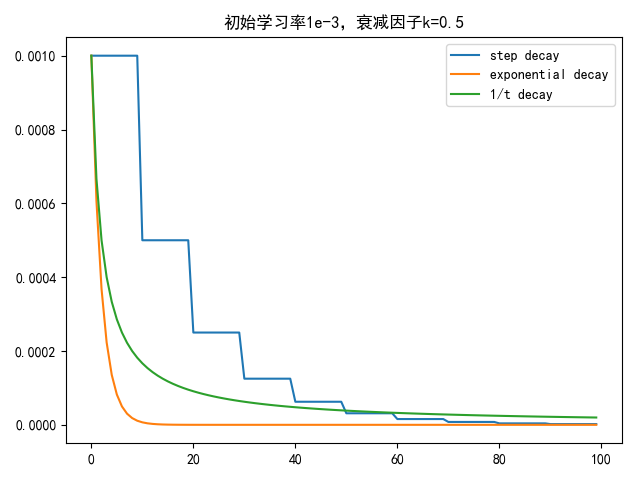
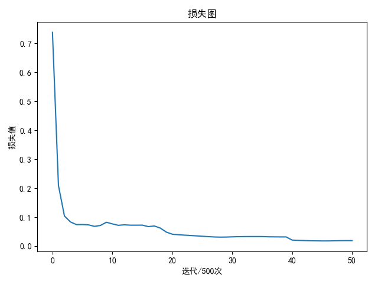
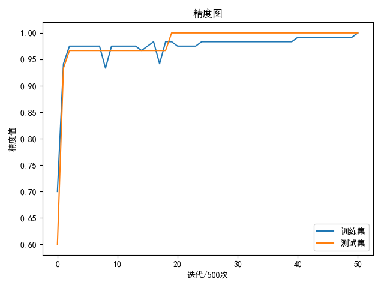

参考：

[Annealing the learning rate](http://cs231n.github.io/neural-networks-3/#anneal)

[学习率退火](https://zhuanlan.zhihu.com/p/21798784)

在标准随机梯度下降过程中，每次更新使用固定学习率（`learning rate`），迭代一定次数后损失值不再下降，一种解释是因为权重在最优点周围打转，如果能够在迭代过程中减小学习率，就能够更加接近最优点，实现更高的检测精度

学习率退火（`annealing the learning rate`）属于优化策略的一种，有`3`种方式实现学习率随时间下降

1. 随步数衰减（`step decay`）
2. 指数衰减（`exponential decay`）
3. `1/t`衰减（`1/t decay`）

下面介绍这`3`种学习率退火实现，然后用`numpy`编程进行验证

## 随步数衰减

随步数衰减（`step decay`）指的是多次迭代后降低学习率再继续迭代

如果选择固定迭代次数，实现公式如下：

$$
lr = lr_{0} * \beta^{t/T}
$$

* $lr$表示学习率
* $lr_{0}$表示初始学习率
* $\beta$表示衰减因子，通常是0.5
* $t$表示迭代次数
* $T$是一个常量，表示迭代次数

其中$t/T$是一个整数除法，比如$2/4=0, 5/4=1$

迭代多少次才进行学习率衰减取决于实际问题和模型，如果无法确定可以先打印出标准的随机梯度下降过程的验证集误差（`val error`），选择验证集误差不再下降的时候降低学习率

## 指数衰减

指数衰减（`exponential decay`）指的是学习率随迭代次数指数下降，数学公式如下：

$$
lr = lr_{0} e^{-kt}
$$

* $lr$表示学习率
* $lr_{0}$表示初始学习率
* $k$表示衰减因子
* $t$是迭代次数

其衰减速度随指数下降，一方面可以提高初始学习率，另一方面可以结合随步数衰减策略，多次迭代后再衰减，这样可以探索更大的权重空间

## 1/t衰减

`1/t`衰减实现公式如下：

$$
lr = lr_{0}/(1+kt)
$$

* $lr$表示学习率
* $lr_{0}$表示初始学习率
* $k$表示衰减因子
* $t$是迭代次数

## 衰减比较

假定初始学习率为`1e-3`，衰减因子`k=0.5`，随步长衰减方式每隔`10`次迭代衰减一次，结果如下

```
import matplotlib.pyplot as plt
import numpy as np

if __name__ == '__main__':
    lr = 1e-3
    k = 0.5
    a = np.repeat(np.arange(10), 10)
    print(a)

    x = np.arange(0, 100)
    y1 = lr * np.power(k, a)
    y2 = lr * np.exp(x * k * -1)
    y3 = lr / (1 + k * x)

    plt.title('初始学习率1e-3，衰减因子k=0.5')
    plt.plot(x, y1, label='step decay')
    plt.plot(x, y2, label='exponential decay')
    plt.plot(x, y3, label='1/t decay')
    plt.legend()
    plt.show()
```



从数值上看，指数衰减最快，随步长衰减最不平滑，`1/t`衰减是前`2`者的折中

从概念上看，随步长衰减最具解释性

## Iris分类

参考[iris数据集](https://www.zhujian.tech/posts/ba2ca878.html)，使用3层神经网络实现`Iris`数据集分类

网络和训练参数如下：

```
# 批量大小
N = 120
# 输入维数
D = 4
# 隐藏层大小
H1 = 20
H2 = 20
# 输出类别
K = 3

# 学习率
learning_rate = 5e-2
# 正则化强度
lambda_rate = 1e-3
```

训练`1`万次得到最好的训练集精度`98.33%`，验证集精度为`100.00%`

使用随步数衰减方法，设置初始学习率为`1e-3`，每隔`1`万次迭代降低一半学习率





```
epoch: 23500 loss: 0.017741
epoch: 24000 loss: 0.018153
epoch: 24500 loss: 0.018558
epoch: 25000 loss: 0.018764
epoch: 25500 loss: 0.018719
loss: [0.7379489541275116, 0.20908036151565673, 0.10376114688270188, 0.08329572639151012, 0.07412643490314004, 0.07430345900744695, 0.07329295342743611, 0.06805091543927848, 0.07108344457821464, 0.08216043914493876, 0.07653607556430879, 0.07156388982573988, 0.07343534475625284, 0.07208068217751779, 0.0720487384083792, 0.07222908671895177, 0.06718030446399169, 0.06926601609539103, 0.06213898417682324, 0.048173863501391634, 0.04090511152968822, 0.039191952291425525, 0.03774620932625705, 0.036470436045793926, 0.03520645248822737, 0.0339090050684377, 0.03254478210455497, 0.03136029152475116, 0.03083107298989087, 0.031088612177247885, 0.031830754113294016, 0.03244430157874315, 0.032756847542928104, 0.0328499065045292, 0.03287723349959883, 0.03279460842225148, 0.03199686035899375, 0.031768831964163566, 0.03155549009925631, 0.03148352140369718, 0.020641865478458574, 0.019643064986634092, 0.018938254489189885, 0.018306088376815275, 0.018001452040576762, 0.017746890705130948, 0.017741358711630295, 0.018153272132707534, 0.018558267622501148, 0.018764374296570147, 0.01871930452412146]
train: [0.7, 0.9416666666666667, 0.975, 0.975, 0.975, 0.975, 0.975, 0.975, 0.9333333333333333, 0.975, 0.975, 0.975, 0.975, 0.975, 0.9666666666666667, 0.975, 0.9833333333333333, 0.9416666666666667, 0.9833333333333333, 0.9833333333333333, 0.975, 0.975, 0.975, 0.975, 0.9833333333333333, 0.9833333333333333, 0.9833333333333333, 0.9833333333333333, 0.9833333333333333, 0.9833333333333333, 0.9833333333333333, 0.9833333333333333, 0.9833333333333333, 0.9833333333333333, 0.9833333333333333, 0.9833333333333333, 0.9833333333333333, 0.9833333333333333, 0.9833333333333333, 0.9833333333333333, 0.9916666666666667, 0.9916666666666667, 0.9916666666666667, 0.9916666666666667, 0.9916666666666667, 0.9916666666666667, 0.9916666666666667, 0.9916666666666667, 0.9916666666666667, 0.9916666666666667, 1.0]
test: [0.6, 0.9333333333333333, 0.9666666666666667, 0.9666666666666667, 0.9666666666666667, 0.9666666666666667, 0.9666666666666667, 0.9666666666666667, 0.9666666666666667, 0.9666666666666667, 0.9666666666666667, 0.9666666666666667, 0.9666666666666667, 0.9666666666666667, 0.9666666666666667, 0.9666666666666667, 0.9666666666666667, 0.9666666666666667, 0.9666666666666667, 1.0, 1.0, 1.0, 1.0, 1.0, 1.0, 1.0, 1.0, 1.0, 1.0, 1.0, 1.0, 1.0, 1.0, 1.0, 1.0, 1.0, 1.0, 1.0, 1.0, 1.0, 1.0, 1.0, 1.0, 1.0, 1.0, 1.0, 1.0, 1.0, 1.0, 1.0, 1.0]
```

共训练`25500`次实现`100%`的训练集精度和测试集精度

```
if __name__ == '__main__':
    x_train, x_test, y_train, y_test = load_data(shuffle=True, tsize=0.8)

    net = ThreeLayerNet(D, H1, H2, K)
    criterion = CrossEntropyLoss()

    loss_list = []
    train_list = []
    test_list = []
    total_loss = 0
    for i in range(epochs):
        scores = net(x_train)
        total_loss += criterion(scores, y_train)

        grad_out = criterion.backward()
        net.backward(grad_out)
        net.update(lr=learning_rate, reg=0)

        if (i % 500) == 499:
            print('epoch: %d loss: %f' % (i + 1, total_loss / 500))
            loss_list.append(total_loss / 500)
            total_loss = 0

            train_accuracy = compute_accuracy(scores, y_train)
            test_accuracy = compute_accuracy(net(x_test), y_test)
            train_list.append(train_accuracy)
            test_list.append(test_accuracy)
            if train_accuracy >= 0.9999 and test_accuracy >= 0.9999:
                save_params(net.get_params(), path='three_layer_net_iris.pkl')
                break
        if (i % 10000) == 9999:
            # 每隔10000次降低学习率
            learning_rate *= 0.5
```

完整代码：[ PyNet/src/three_layer_net_iris.py ](https://github.com/zjZSTU/PyNet/blob/master/src/three_layer_net_iris.py)

参数地址：[ PyNet/model/three_layer_net_iris.pkl ](https://github.com/zjZSTU/PyNet/blob/master/model/three_layer_net_iris.pkl)