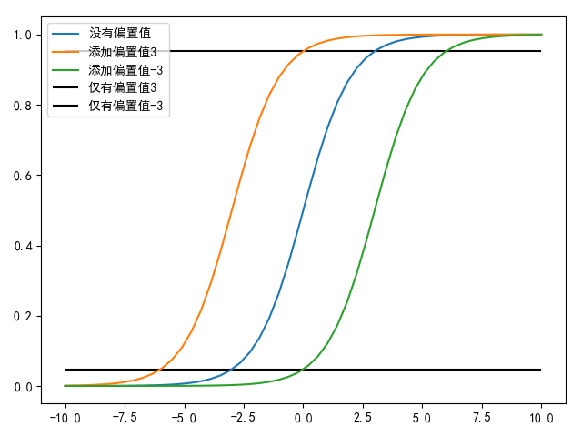

参考：[Neural Networks Part 1: Setting up the Architecture ](http://cs231n.github.io/neural-networks-1/)

神经网络是卷积神经网络的基础，其包含的层架构、激活函数、反向传播、正则化等等内容都可以应用于卷积神经网络

## 生物神经元

神经网络是因为生物神经系统的研究而得到启发的，人脑基本的计算单位是神经元（`neuron`）

简单的神经元实现如下：通过树突（`dendrity`）接收信号，经过细胞体（`cell body`）处理后再通过轴突（`axon`）传输到其他神经元

数学建模如下：每个树突会有一个权重值$w$，接受到信号$x$后会进行乘法交互$w\cdot x$，所有的信号会在细胞体中求和$\sum w\cdot x$，如果总和达到某一阈值，就通过轴突向外发送信号


$$
y=f(\sum w_{i}\cdot x_{i})
$$

*把阈值函数称为激活函数（`activate function`）*

*逻辑回归就是一个典型的单神经元架构，其输入一组向量，经过线性计算后再通过`sigmoid`函数输出*

*每个神经元都可以设置一个偏置值（`bias`）*

## 神经网络

单个神经元能够实现二元分类问题，组合多个神经元就能够实现多元分类

### 网络架构

神经网络以层的结构组织神经元，每一层可以有多个神经元，每个神经元都与前一层所有神经元全部连接，同层神经元互不连接，所以神经网络层的类型称为全连接层（`fully-connected layer`）

输入层神经元得到输入数据后，直接传送给下一层神经元，没有经过激活函数处理

输出层神经元得到输出，进行线性计算后**不经过激活函数处理**，直接向外发送，进行评分函数或损失函数处理

*`softmax`回归就是一个单层神经网络模型*

### 命名规范

1. 神经网络（`neural network`）也被称为人工神经网络（`artifical neural networks, ANN`），或者称为多层感知器（`multi-layer perceptrons, MLP`）；神经元（`neuron`）也被称为单元（`unit`）
2. 神经网络把第一层称为输入层（`input layer`），把最后一层称为输出层（`output layer`），把中间层称为隐藏层（`hidden layer`）
3. 通常不把输入层计入网络层数，也就是说一个单层神经网络指的是没有隐藏层的神经网络（输入层直接连接输出层）

单层神经网络和`2`层神经网络如下所示


### 网络大小评判

通常使用神经元个数和可学习参数（权重值+偏置值）个数来评判神经网络大小

**注意：不包括输入层**

* 在上图单层神经网络中，神经元个数是$3$，权重个数是$5\times 3=15$，偏置值个数是$3$，所以可学习参数（learnable parameter）是$18$个
* 在上图2层神经网络中，神经元个数是$4+2=6$，权重个数是$3\times 4+4\times 2=20$个，偏置值是$4+2=6$个，所以可学习参数是$26$个

### 拟合能力

参考：[Representational power](http://cs231n.github.io/neural-networks-1/)

参考[Approximation by Superpositions of Sigmoidal Function](http://www.dartmouth.edu/~gvc/Cybenko_MCSS.pdf)和[A visual proof that neural nets can compute any function](http://neuralnetworksanddeeplearning.com/chap4.html)，至少一个隐藏层的神经网络是一个通用逼近器（`universal approximator`），它能够近似（`approximate`）任何连续函数（`continuous function`），即给定任何连续函数$f(x)$和误差$\epsilon>0$，存在一个神经网络$g(x)$，对$\forall x,有|f(x)-g(x)|<\epsilon$

#### 网络深度与拟合能力

理论上单层隐藏层神经网络就能够近似所有的连续函数，但是更深的神经网络在实践中能够实现更好的分类结果

参考文章[深层神经网络与浅层神经网络的区别](https://blog.csdn.net/ybdesire/article/details/78837688)

作者给出两个解释是

1. 在设计单层隐藏层神经网络模型时是否能够提供足够多的神经元
2. 如果目标是拟合非连续函数

在`cs231n`课程中，推荐使用3层神经网络，它能够比`2`层神经网络性能更优，但是更深的神经网络（`4/5/6`层）没有更多的帮助，并提供了一个[JS Demo](https://cs.stanford.edu/people/karpathy/convnetjs/demo/classify2d.html)进行验证

### 激活函数作用

参考：

[神经网络激活函数的作用是什么？](https://blog.csdn.net/program_developer/article/details/78704224)

[理解激活函数在神经网络模型构建中的作用](https://cloud.tencent.com/developer/article/1010097)

[请问人工神经网络中的activation function的作用具体是什么？为什么ReLu要好过于tanh和sigmoid function?](https://www.zhihu.com/question/29021768)

在神经网络中，激活函数得到前一层输出向量和权重的加权求和向量后进行非线性组合，**其目的是为神经网络添加非线性因素，提高网络表达能力，解决线性模型不能解决的非线性问题**

* **数值上表现**：挤压输入向量，比如`sigmoid`输出范围`[0,1]`，`tanh`输出范围`[-1,1]`，`ReLU`输出范围`[0,x]`
* **空间上表现**：扭曲分类决策面，产生非线性决策面

### 权重向量和偏置值

参考：[Role of Bias in Neural Networks](https://stackoverflow.com/questions/2480650/role-of-bias-in-neural-networks)

每个神经元都包含一个权重向量和一个偏置值（输入层除外），**权重向量的作用是决定分类决策面的方向，偏置值的作用是确定分类决策面的位置**

对单个神经元而言，其表达公式如下：

$$
output = g(w\cdot x+b)
$$

其中$output$是输出向量，$g()$是激活函数，$w$是权重向量，$x$是输入向量，$b$是偏置值。以二维坐标轴为例

* 如果仅有权重向量，其分类决策面一定要经过零点，所以**偏置值的作用就是帮助决策面在坐标轴上左右移动，确定分类位置**

* 如果仅有偏置值，其分类决策面仅是一条水平线，所以**权重向量的作用就是扭曲决策面，确定分类方向**

```
# -*- coding: utf-8 -*-

# @Time    : 19-5-4 上午10:19
# @Author  : zj

import matplotlib.pyplot as plt
import numpy as np


def sigmoid(x):
    return 1.0 / (1 + np.exp(-1 * x))


if __name__ == '__main__':
    x = np.linspace(-10, 10)
    y = sigmoid(x)
    y2 = sigmoid(x + 3)
    y3 = sigmoid(x - 3)
    y4 = sigmoid(3)
    y5 = sigmoid(-3)

    plt.plot(x, y, label='没有偏置值')
    plt.plot(x, y2, label='添加偏置值3')
    plt.plot(x, y3, label='添加偏置值-3')
    plt.hlines(y4, -10, 10, label='仅有偏置值3')
    plt.hlines(y5, -10, 10, label='仅有偏置值-3')
    plt.legend()
    plt.show()
```

